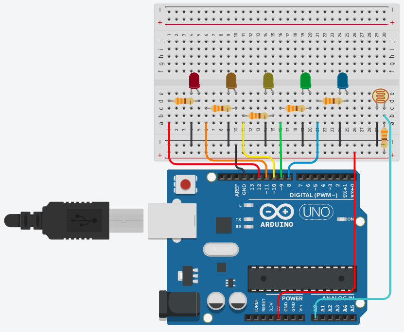

# ARDUINO BASED TURBIDITY SENSOR

    <a href="##Project Description">Project Description</a> •
    <a href="##Simplicity">Simplicity</a> •
    <a href="##How to build it">How To Bild</a> •
    <a href="##Disclaimers">Disclaimers</a> •
    <a href="##Special Thanks">Special Thanks</a>

 

## Project Description
> As a real turbidity sensor (which is sold in electronics stores) usually has a high price, the idea of this project came to replace such equipment with lower-priced ones and obtain a similar result. Consisting basically of an Arduino UNO and an LDR resistor, the project also becomes more customizable depending on the purpose for which it is intended.
>
> Through an external light source that passes through the glass of water, it is possible to capture the voltage of the LDR resistor and transform this data into a certain level of turbidity of the liquid. The higher the voltage, the dirtier the water is.

 

## How to build it
> Materials
<ul>
    <li>1 Box</li>
    <li>Cup holder</li>
    <li>Flashlight</li>
    <li>Arduino UNO</li>
    <li>Protoboard</li>
    <li>1 LDR resistor</li>
    <li>5 led's</li>
    <li>5 x ohms resistors</li>
    <li>1 x ohm resistor</li>
    <li>Jumpers</li>
</ul>

> Mounting
<ul>
    <li>First you have to make the cuts in the box to fit the elements and then place them in the right position, with the LDR just below the cup. It is advisable to paint the box black to help retain more the light. Afterwards, the necessary connections of the components are made on the protoboad, always remembering to position the LEDs in order to facilitate their visualization. Finally, the Arduino is connected to the computer to pass the code and put the system into running. To use, just place your water sample in the appropriate place and see the result based on the color of the LEDs.</li>
</ul>

<h1 align="center">
    
</h1>

 

## Simplicity
> As you can see, despite having a set of relatively simple materials (with components easily found in computer stores and other home materials), the system has a very useful and interesting application that can be extended to some research or extension project, such as a future improvement and implementation in needy communities that, with the help of this equipment, could analyze the quality of the water that arrives in the place where they live and who knows, make an appeal to the authorities, directly improving their quality of life.

 

## Special Thanks
> The owners of this code sincerely thanks the help from the UFES's Teacher and Lab Manager **_Vinicius Motta_** during this project development.

 

----

Made with 🤍 by
* CAIO FIOROTTI 👏 [See my GitHub](https://github.com/fiorotticaio) 
* HENRIQUE CAETANO 👏 [See my GitHub](https://github.com/1700KeeQ) 
* MATHEUS SCHREIBER 👏 [See my GitHub](https://github.com/matheusschreiber)

 

<h4 align="center">
🚧 Project 🚀 Under construction ... 🚧
</h4>
                

